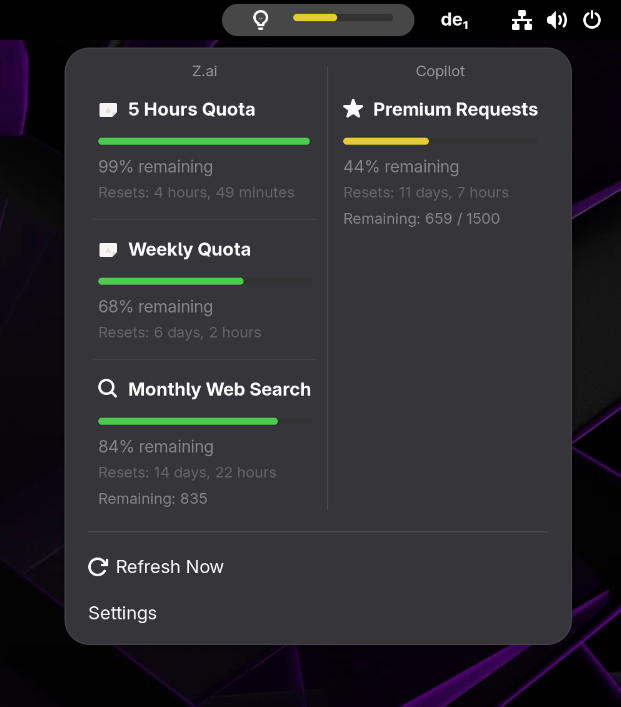

# Token Gauge

A GNOME Shell extension that shows the available quota of your AI coding plan
(Z.ai, GitHub Copilot*) in the top panel.

`*` providers only work through Kilo CLI.



## Requirements

- GNOME Shell 49
- Optional: [Kilo CLI](https://kilo.ai) for `auth.json`-based credentials
- For manual API key entry: GNOME Keyring (`libsecret`)

## Install (manual)

```bash
git clone https://github.com/ben-oswald/token_gauge.git
cd token_gauge
./build.sh                              # produces dist/token_gauge@oswald.dev.shell-extension.zip
gnome-extensions install --force dist/token_gauge@oswald.dev.shell-extension.zip
gnome-extensions enable token_gauge@oswald.dev
```

Log out and back in (or restart GNOME Shell on X11) after installing.

## Build

`./build.sh` packages the extension with `gnome-extensions pack` and lints the
resulting zip with [`shexli`](https://gitlab.gnome.org/World/shexli). Override
the output directory with `OUT_DIR=/some/path ./build.sh`.

Requirements for building:
- `gnome-extensions` (from `gnome-shell`)
- `shexli` on `$PATH` (or installed at `~/venv/bin/shexli`)

## License

[AGPL-3.0-or-later](LICENSE) © 2026 Benjamin Oswald &lt;info@oswald.dev&gt;
